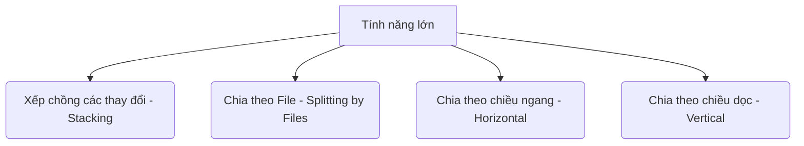
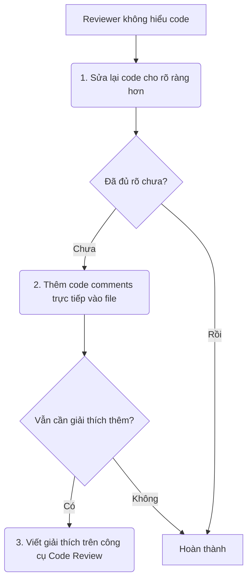

# 📘 Cẩm Nang Hướng Dẫn Lập Trình & Quy Trình Phát Triển Phần Mềm
*Tài liệu tổng hợp quy chuẩn Clean Code Python và quy trình quản lý, kiểm duyệt mã nguồn (Code Review)*

---

Tài liệu này được biên soạn nhằm nhất quán hóa phong cách lập trình và tối ưu hóa quy trình cộng tác thông qua Code Review trong dự án. Nội dung được tổng hợp chi tiết từ các tài liệu gốc:
*   [clean_code_guidelines.md](./clean_code_guidelines.md) — Hướng dẫn lập trình sạch Python.
*   [cl_nho.md](./cl_nho.md) — Hướng dẫn chia nhỏ CL/PR.
*   [mo_ta_cl.md](./mo_ta_cl.md) — Cách viết mô tả CL/PR.
*   [xu_ly_y_kien.md](./xu_ly_y_kien.md) — Cách xử lý ý kiến của người duyệt.

---

## 📌 Mục Lục
- [Phần 1: Hướng Dẫn Lập Trình Sạch Cho Python (Clean Code PEP 8)](#phần-1-hướng-dẫn-lập-trình-sạch-cho-python-clean-code-pep-8)
  - [1.1 Quy tắc đặt tên (Naming Conventions)](#11-quy-tắc-đặt-tên-naming-conventions)
  - [1.2 Thiết kế Hàm & Phương thức (Function/Method Design)](#12-thiết-kế-hàm--phương-thức-functionmethod-design)
  - [1.3 Nguyên tắc Quản lý Lỗi & Exception](#13-nguyên-tắc-quản-lý-lỗi--exception)
  - [1.4 Hướng đối tượng (OOP) & SOLID](#14-hướng-đối-tượng-oop--solid)
  - [1.5 Chú thích (Comments) & Docstrings](#15-chú-thích-comments--docstrings)
  - [1.6 Công cụ tự động hóa Clean Code](#16-công-cụ-tự-động-hóa-clean-code)
- [Phần 2: Quy Trình Chia Nhỏ CL/PR (Keeping CLs Small)](#phần-2-quy-trình-chia-nhỏ-clpr-keeping-cls-small)
  - [2.1 Lợi ích của việc chia nhỏ CL/PR](#21-lợi-ích-của-việc-chia-nhỏ-clpr)
  - [2.2 Định nghĩa một CL/PR "nhỏ"](#22-định-nghĩa-một-clpr-nhỏ)
  - [2.3 Các chiến lược chia nhỏ CL/PR](#23-các-chiến-lược-chia-nhỏ-clpr)
  - [2.4 Đảm bảo không làm hỏng bản Build](#24-đảm-bảo-không-làm-hỏng-bản-build)
- [Phần 3: Cách Viết Mô Tả CL/PR Rõ Ràng (Writing CL Descriptions)](#phần-3-cách-viết-mô-tả-clpr-rõ-ràng-writing-cl-descriptions)
  - [3.1 Quy tắc dòng đầu tiên (First Line)](#31-quy-tắc-dòng-đầu-tiên-first-line)
  - [3.2 Nội dung phần thân (Body)](#32-nội-dung-phần-thân-body)
  - [3.3 Ví dụ Mô tả Tốt vs Tồi](#33-ví-dụ-mô-tả-tốt-vs-tồi)
- [Phần 4: Tiếp Thu & Xử Lý Ý Kiến Người Duyệt (Handling Comments)](#phần-4-tiếp-thu--xử-lý-ý-kiến-người-duyệt-handling-comments)
  - [4.1 Thái độ đón nhận phản hồi](#41-thái-độ-đón-nhận-phản-hồi)
  - [4.2 Nguyên tắc "Sửa trực tiếp trong code"](#42-nguyên-tắc-sửa-trực-tiếp-trong-code)
  - [4.3 Tư duy cộng tác & Giải quyết xung đột](#43-tư-duy-cộng-tác--giải-quyết-xung-đột)

---

## 🛠 Phần 1: Hướng Dẫn Lập Trình Sạch Cho Python (Clean Code PEP 8)

Triết lý cốt lõi của Python là **"The Zen of Python"**: *"Rõ ràng tốt hơn che đậy, đơn giản tốt hơn phức tạp, và dễ đọc là yếu tố quyết định."*

### 1.1 Quy tắc đặt tên (Naming Conventions)
Mọi lập trình viên Python phải tuân thủ chuẩn đặt tên theo **PEP 8**:

*   **Biến & Hàm (Variables & Functions):** Sử dụng `snake_case` (chữ thường, cách nhau bởi dấu gạch dưới).
*   **Lớp (Classes):** Sử dụng `PascalCase` (chữ cái đầu viết hoa, không gạch dưới).
*   **Hằng số (Constants):** Sử dụng `UPPER_SNAKE_CASE` (viết hoa toàn bộ).
*   **Phương thức ẩn (Private/Protected):** Bắt đầu bằng một dấu gạch dưới `_protected_method` hoặc hai dấu gạch dưới `__private_method`.
*   **Tránh ký tự đơn lẻ/mơ hồ:** Không đặt tên biến là `i, j, k` (trừ vòng lặp cực ngắn) hay `l` (dễ nhầm với `1`), `O` (dễ nhầm với `0`).

| Loại đối tượng | ❌ Bad Practice | ✅ Good Practice |
| :--- | :--- | :--- |
| **Lớp (Class)** | `class user_account:` | `class UserAccount:` |
| **Hàm / Phương thức** | `def GetUserData(self):` | `def get_user_data(self):` |
| **Hằng số (Constant)** | `MAXLIMIT = 100` | `MAX_LIMIT = 100` |
| **Biến (Variable)** | `UserName = "Leo"` | `user_name = "Leo"` |

---

### 1.2 Thiết kế Hàm & Phương thức (Function/Method Design)

#### ⚡ Bẫy "Tham số mặc định kiểu Mutable" (Mutable Default Arguments Trap)
Trong Python, các giá trị mặc định chỉ được khởi tạo **một lần duy nhất** khi import module. Việc gán mặc định bằng các kiểu dữ liệu có thể thay đổi (mutable) như `list`, `dict`, `set` sẽ dẫn đến việc dùng chung bộ nhớ giữa các lần gọi hàm, gây sai lệch dữ liệu nghiêm trọng.

*   ❌ **Sai:**
    ```python
    def add_employee(name, employee_list=[]):  # List mặc định bị dùng chung!
        employee_list.append(name)
        return employee_list
    # add_employee("Alice") -> ['Alice']
    # add_employee("Bob")   -> ['Alice', 'Bob'] (Lỗi!)
    ```
*   ✅ **Đúng (Pythonic):**
    ```python
    def add_employee(name, employee_list=None):
        if employee_list is None:
            employee_list = []  # Khởi tạo mới mỗi lần gọi hàm
        employee_list.append(name)
        return employee_list
    ```

#### 📌 Nguyên tắc Đơn Nhiệm (Single Responsibility) & Type Hinting
*   Mỗi hàm chỉ nên làm **một việc duy nhất** và làm thật tốt việc đó.
*   Sử dụng **Type Hinting** (từ Python 3.5+) để code rõ ràng, tự tài liệu hóa và giúp IDE bắt lỗi sớm.
*   *Lưu ý circular imports:* Sử dụng `from typing import TYPE_CHECKING` để tránh vòng lặp import khi gợi ý kiểu.

```python
# Tách biệt các chức năng rõ ràng và có gợi ý kiểu dữ liệu
def calculate_discounted_price(original_price: float, discount: float) -> float:
    return max(0.0, original_price - discount)

def update_order_price_in_db(order: "Order", final_price: float) -> None:
    order.price = final_price
    database.save(order)
```

#### 🚫 Tránh sử dụng cờ Boolean làm tham số (Flag Arguments)
Khi truyền các tham số Boolean `True/False` trực tiếp vào hàm, nó khiến người đọc bên ngoài khó hiểu hàm đang làm gì. Thay vào đó, hãy tách thành các hàm riêng biệt hoặc sử dụng **Keyword-Only Arguments** (dùng dấu `*` trong định nghĩa tham số) để bắt buộc chỉ rõ tên tham số khi gọi hàm.

*   ❌ **Sai:** `set_status(102, True, False)` (Không rõ True, False nghĩa là gì)
*   ✅ **Đúng:**
    ```python
    def set_user_status(user_id: int, *, is_active: bool, is_admin: bool) -> None:
        pass

    set_user_status(102, is_active=True, is_admin=False)  # Tường minh và an toàn
    ```

---

### 1.3 Nguyên tắc Quản lý Lỗi & Exception
*   **Luôn bắt Exception cụ thể:** Tránh sử dụng khối ngoại lệ trống `except:` (bare except) hoặc bắt lớp cha `Exception` quá chung chung vì nó sẽ bắt cả lỗi hệ thống (như `SystemExit`, `KeyboardInterrupt` làm mất tác dụng của `Ctrl+C`).
*   *Ví dụ:*
    ```python
    import json
    import logging

    logger = logging.getLogger(__name__)

    def load_config(file_path: str) -> dict:
        try:
            with open(file_path, "r") as f:
                return json.load(f)
        except FileNotFoundError:
            logger.warning(f"Không tìm thấy cấu hình tại {file_path}. Dùng mặc định.")
            return {}
        except json.JSONDecodeError:
            logger.error(f"File {file_path} sai định dạng JSON.")
            raise  # Ném tiếp lỗi ra ngoài nếu cần thiết
    ```

---

### 1.4 Hướng đối tượng (OOP) & SOLID
*   **Single Responsibility Principle (SRP):** Một lớp chỉ chịu trách nhiệm cho một nghiệp vụ duy nhất.
*   **Không viết Getter/Setter thủ công:** Trong Python, tránh viết các hàm như `get_age()` hay `set_age()`. Hãy sử dụng decorator `@property` để truy cập tự nhiên như một thuộc tính mà vẫn bảo toàn logic kiểm soát.

```python
class Rectangle:
    def __init__(self, width: float, height: float):
        self.width = width
        self.height = height

    @property
    def area(self) -> float:
        return self.width * self.height

rect = Rectangle(10, 5)
print(rect.area)  # Gọi thuộc tính trực tiếp, không dùng dấu ()
```

---

### 1.5 Chú thích (Comments) & Docstrings
Trong Python, có sự phân biệt rạch ròi giữa Docstrings (`"""`) và Comments (`#`):

1.  **Docstrings (PEP 257):** Dùng để giải thích **cách sử dụng** (API interface) của module, class, hoặc hàm cho người bên ngoài gọi vào.
2.  **Comments:** Dùng để giải thích **tại sao (WHY)** một đoạn code phức tạp bên trong lại được viết như vậy.
3.  **Không dùng comment để giải thích code tồi:** Nếu code quá phức tạp, hãy refactor để code tự giải thích chính nó thông qua các biến phụ và hàm nhỏ.

*Ví dụ về Docstring chuẩn:*
```python
def calculate_compound_interest(principal: float, rate: float, time: int) -> float:
    """Tính toán lãi kép tích lũy theo năm.

    Args:
        principal: Số tiền gốc ban đầu (phải > 0).
        rate: Lãi suất năm dưới dạng thập phân (ví dụ: 0.05 đại diện cho 5%).
        time: Số năm gửi tiết kiệm.

    Returns:
        Tổng số tiền tích lũy cả gốc lẫn lãi sau thời gian gửi.

    Raises:
        ValueError: Nếu số tiền gốc hoặc thời gian gửi <= 0.
    """
    if principal <= 0 or time <= 0:
        raise ValueError("Số tiền gốc và số năm phải lớn hơn không.")
    return principal * ((1 + rate) ** time)
```

---

### 1.6 Công cụ tự động hóa Clean Code
Để duy trì chuẩn code đồng nhất mà không tốn thời gian tranh cãi trong team, dự án khuyến nghị tích hợp các công cụ sau vào pre-commit hooks hoặc CI/CD pipeline:
1.  **Ruff:** Bộ linter và formatter siêu nhanh (viết bằng Rust) thay thế hoàn hảo cho `Flake8` (kiểm tra cú pháp) và `isort` (sắp xếp import).
2.  **Black:** Công cụ định dạng mã nguồn tự động nghiêm ngặt nhất ("The uncompromising code formatter").
3.  **MyPy:** Công cụ kiểm tra kiểu tĩnh (Static Type Checker) dựa trên Type Hints.

---

## 📦 Phần 2: Quy Trình Chia Nhỏ CL/PR (Keeping CLs Small)

Một bản sửa đổi (CL - Changelist / PR - Pull Request) nên có kích thước nhỏ và tập trung. Người kiểm duyệt có quyền từ chối review nếu CL/PR quá lớn.

### 2.1 Lợi ích của việc chia nhỏ CL/PR
*   **Duyệt nhanh hơn:** Reviewer dễ dàng tranh thủ 5 phút để duyệt một CL nhỏ thay vì dành 30 phút liên tục cho một CL lớn.
*   **Kỹ lưỡng hơn:** Tránh quá tải thông tin, giảm thiểu tối đa việc bỏ sót lỗi nghiêm trọng.
*   **Ít phát sinh bug:** Dễ dàng phân tích tác động của các thay đổi nhỏ.
*   **Dễ Merge & Dễ Rollback:** Giảm thiểu xung đột code (conflict) khi merge và cực kỳ dễ dàng hoàn tác (rollback) khi xảy ra lỗi vận hành.

---

### 2.2 Định nghĩa một CL/PR "nhỏ"
Một CL/PR chuẩn là **một thay đổi độc lập và tự đóng gói (one self-contained change)**:
*   Chỉ giải quyết **duy nhất một công việc** (một phần nhỏ của tính năng).
*   **Bao gồm cả mã nguồn kiểm thử (test code)** liên quan trực tiếp.
*   Hệ thống vẫn phải build thành công và hoạt động bình thường sau khi merge.
*   **Quy mô ước lượng:** Thông thường khoảng **100 dòng code** là kích thước lý tưởng. Khoảng **1000 dòng code** bắt đầu được xem là quá lớn (trừ các trường hợp ngoại lệ như xóa file hoặc code được tự động sinh bởi công cụ đáng tin cậy).

---

### 2.3 Các chiến lược chia nhỏ CL/PR
Trước khi viết code cho một tính năng lớn, hãy lập kế hoạch chia nhỏ CL/PR theo các chiến lược sau:



1.  **Xếp chồng các thay đổi (Stacking Changes):** Viết một CL nhỏ, gửi đi review, rồi ngay lập tức tạo nhánh mới dựa trên nhánh hiện tại để viết tiếp phần 2.
2.  **Chia theo file (Splitting by Files):** Tách các nhóm file cần các reviewer có chuyên môn khác nhau phê duyệt (Ví dụ: Một CL định nghĩa Protocol Buffer trước, một CL chứa logic nghiệp vụ sử dụng Proto đó sau).
3.  **Chia theo chiều ngang (Splitting Horizontally):** Tạo các lớp dùng chung hoặc các hàm giả lập (stubs) để tách biệt các tầng công nghệ (Client, API, Service, Data Model) giúp phát triển song song.
4.  **Chia theo chiều dọc (Splitting Vertically):** Chia tính năng lớn thành các tính năng nhỏ chạy được từ đầu đến cuối (full-stack). Mỗi tính năng này độc lập và có thể chạy được.
    *   *Ví dụ:* Thêm chức năng Nhân và Chia cho máy tính -> Tách thành CL phép Nhân (gồm UI, API, Logic) và CL phép Chia riêng biệt.

#### Bảng kết hợp phân rã Ngang & Dọc (Grid Splitting):
| Tầng (Layer) | Tính năng: Phép Nhân (CL 1) | Tính năng: Phép Chia (CL 2) |
| :--- | :--- | :--- |
| **Client (UI)** | Thêm nút bấm Nhân | Thêm nút bấm Chia |
| **API** | Thêm endpoint `/multiply` | Thêm endpoint `/divide` |
| **Service** | Logic phép nhân | Logic phép chia |
| **Model** | Định nghĩa Proto cho phép nhân | Định nghĩa Proto cho phép chia |

> [!IMPORTANT]
> **Tách biệt tuyệt đối giữa Tái cấu trúc và Tính năng mới:** 
> Hãy luôn gửi các thay đổi tái cấu trúc (refactoring, dọn dẹp, di chuyển file, đổi tên biến) thành các CL/PR riêng biệt trước khi viết code cho tính năng mới. Việc gộp chung sẽ làm git diff cực kỳ rối mắt và làm khó người kiểm duyệt.

---

### 2.4 Đảm bảo không làm hỏng bản Build (Don't Break the Build)
Khi xếp chồng các CL/PR phụ thuộc lẫn nhau, hãy đảm bảo hệ thống **luôn luôn build thành công** sau khi merge từng CL đơn lẻ. Tránh tình trạng merge CL thứ nhất làm hỏng hệ thống và phải đợi merge CL thứ hai mới chạy lại được.

---

## 📝 Phần 3: Cách Viết Mô Tả CL/PR Rõ Ràng (Writing CL Descriptions)

Mô tả CL/PR là hồ sơ công khai vĩnh viễn trong lịch sử dự án. Code chỉ chỉ ra *phần mềm chạy thế nào*, còn mô tả chỉ ra *tại sao nó tồn tại*.

### 3.1 Quy tắc dòng đầu tiên (First Line)
*   **Tóm tắt ngắn gọn** hành động chính được thực hiện.
*   Viết dưới dạng **một câu hoàn chỉnh**, sử dụng **thì hiện tại và thể mệnh lệnh (imperative mood - thể ra lệnh)**.
*   Theo sau bởi **một dòng trống**.

> [!TIP]
> **Ví dụ về dòng đầu tiên:**
> *   ✅ **Nên viết (Thể mệnh lệnh):** `Delete the FizzBuzz RPC and replace it with the new system.`
> *   ❌ **Không nên viết:** `Deleting the FizzBuzz RPC and replacing it...`

---

### 3.2 Nội dung phần thân (Body)
Phần thân cần cung cấp đầy đủ thông tin chi tiết và bối cảnh:
*   Mô tả ngắn gọn về vấn đề đang cần giải quyết.
*   Tại sao giải pháp này là cách tiếp cận tốt nhất và các phương án đánh đổi thiết kế.
*   Bất kỳ hạn chế nào của giải pháp này.
*   Thông tin bổ sung: Bug/Issue ID, kết quả đo hiệu năng (benchmarks), link tài liệu thiết kế.
*   **Sử dụng thẻ phân loại (Tags):** Ví dụ `#banana #apple: Assemble a fruit basket.` ở đầu hoặc cuối mô tả (tránh viết thẻ quá dài ở dòng đầu).
*   **Xem lại trước khi Merge:** Cập nhật lại mô tả CL/PR nếu trong quá trình review bạn đã thay đổi logic code ban đầu.

---

### 3.3 Ví dụ Mô tả Tốt vs Tồi

#### ❌ Ví dụ về mô tả TỒI:
> *   `Fix bug` (Quá mơ hồ, không rõ bug gì, sửa thế nào).
> *   `Fix build.`
> *   `Moving code from A to B.`
> *   `Phase 1.`

#### ✅ Ví dụ về mô tả TỐT (Thay đổi logic nghiệp vụ):
> `RPC: Remove size limit on RPC server message freelist.`
>
> `Servers like FizzBuzz have very large messages and would benefit from reuse. Make the freelist larger, and add a goroutine that frees the freelist entries slowly over time, so that idle servers eventually release all freelist entries.`

---

## 💬 Phần 4: Tiếp Thu & Xử Lý Ý Kiến Người Duyệt (Handling Comments)

### 4.1 Thái độ đón nhận phản hồi
*   **Đừng cá nhân hóa các nhận xét (Don't Take it Personally):** Code review hướng tới nâng cao chất lượng sản phẩm, không phải là sự tấn công cá nhân.
*   **Tuyệt đối không phản hồi khi nóng giận:** Các bình luận tranh cãi thiếu kiên nhẫn sẽ được lưu giữ vĩnh viễn trên hệ thống và hủy hoại hình ảnh chuyên nghiệp của bạn. Nếu cảm thấy bực bội, hãy tạm rời máy tính cho đến khi bình tĩnh.
*   Nếu reviewer liên tục có thái độ không xây dựng, hãy gặp mặt trao đổi trực tiếp hoặc nhờ Quản lý hỗ trợ điều phối.

---

### 4.2 Nguyên tắc "Sửa trực tiếp trong code"
Khi reviewer phản hồi rằng họ không hiểu một đoạn code:



> [!IMPORTANT]
> Việc viết giải thích trên công cụ review chỉ giúp ích cho reviewer hiện tại và sẽ biến mất sau khi merge. **Hãy ưu tiên làm sạch code hoặc viết chú thích trực tiếp trong code** vì nó đem lại giá trị lâu dài cho những người bảo trì tương lai.

---

### 4.3 Tư duy cộng tác & Giải quyết xung đột
*   **Tư duy cùng thắng (Win-Win):** Hãy chắc chắn bạn đã hiểu đúng yêu cầu của người duyệt trước khi phản hồi.
*   **Phản hồi bằng dữ liệu kỹ thuật:** Luôn lịch sự, tôn trọng và đưa ra phân tích ưu/nhược điểm cụ thể thay vì phản hồi cụt lủn hoặc phòng thủ.
    *   *❌ Chưa tốt:* `"Không, tôi sẽ không làm thế."`
    *   *✅ Tốt:* `"Tôi chọn giải pháp X vì có ưu/nhược điểm [nêu chi tiết]... Theo tôi hiểu thì dùng giải pháp Y sẽ gặp hạn chế [nêu lý do]. Bạn có nghĩ giải pháp Y sẽ tối ưu hơn ở điểm nào không?"`
*   **Giải quyết bế tắc:** Nếu thảo luận kỹ thuật đi vào ngõ cụt, hãy thực hiện theo quy trình giải quyết xung đột được quy định chung của dự án (như thảo luận trực tiếp hoặc lấy ý kiến của bên thứ ba có chuyên môn).
